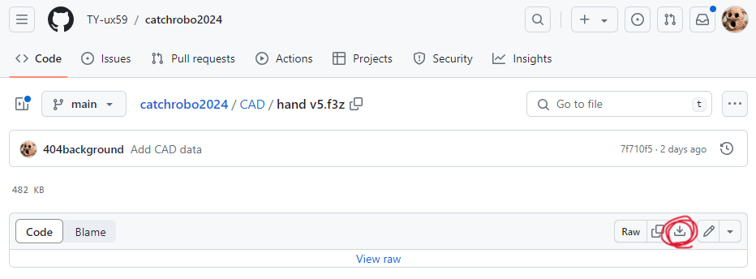
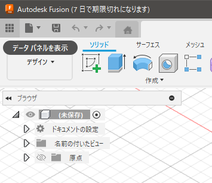
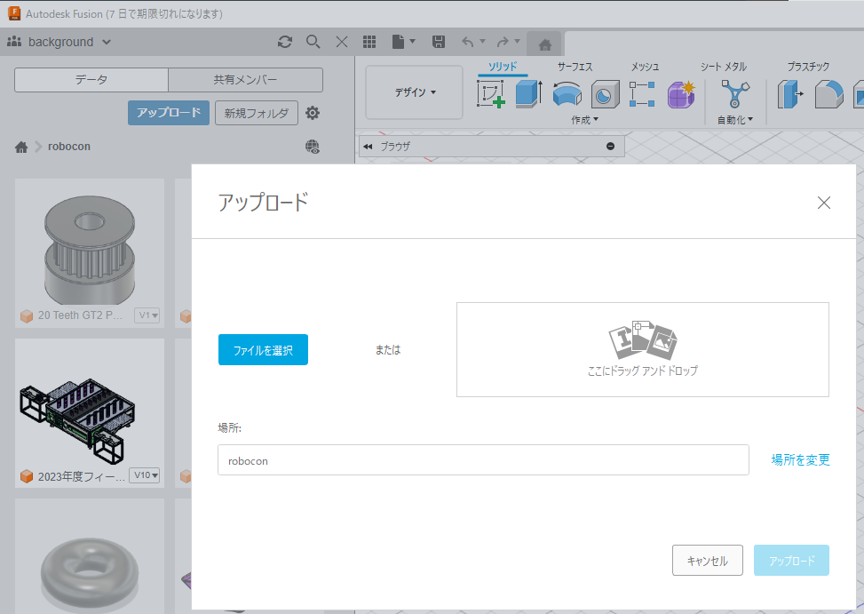
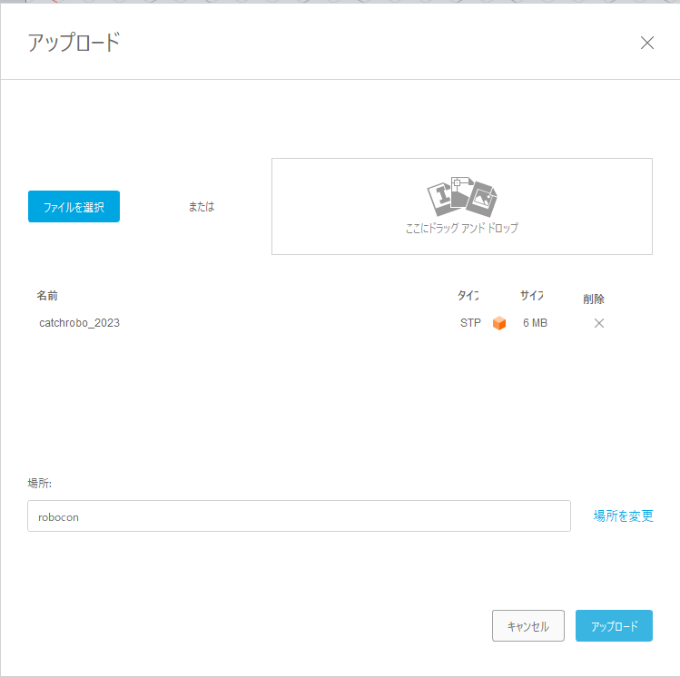
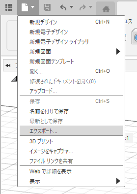
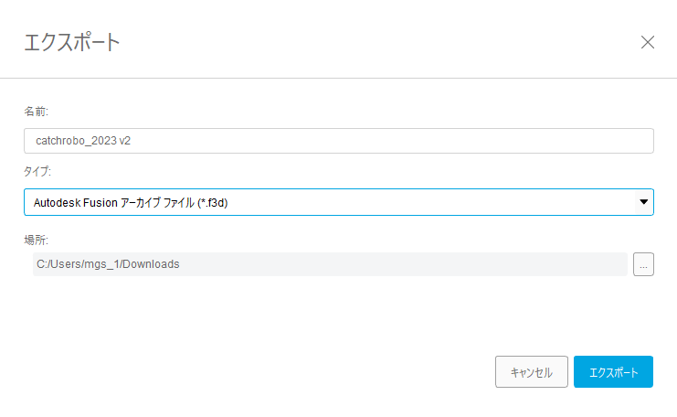

# CAD

## データの取り込み方

### GitHubからのダウンロード

GitHub上でダウンロードしたいファイルを選択してください。  
右側にダウンロードボタンがあります。  

### Fusion 360へのアップロード

まずはデータパネルを開いてください。

アップロードを選択してください。

ファイルを選択するか、ドラッグアンドドロップで追加し、アップロードしてください。

## データのエクスポート

Fusion360でエクスポートを選択します。

ファイル形式は.f3dにしておくと、Fusion360でそのまま取り込めます。

## ファイルの画像

catchrobo_2023.stl

吸引機asm v4.png

hand v5.png

r-robo-re v5.png

